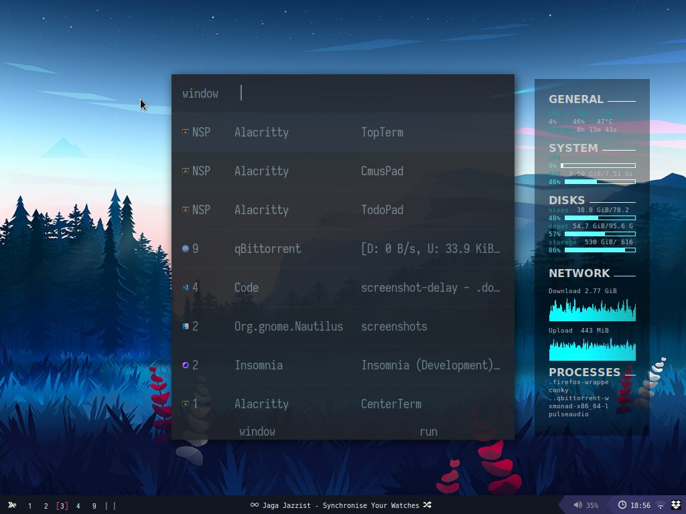

# Desktop

This chapter will focus on the two available desktop environments: XMonad & LXQt.

## XMonad

XMonad is the default user interface for this system. It uses a highly customized configuration that can be further modified. Below is a list of shortcuts nicely organized by categories.

### Launchers

Launchers will be the main way to launch a new program. Rofi is the default launcher, you can use it to launch a new program or to search for one running.

Rofi example.

|           Shortcut | Action                    |
| -----------------: | ------------------------- |
|           `<Mod>d` | _Rofi: run_               |
|           `<Mod>p` | _Rofi: window_            |
|           `<Mod>c` | _Rofi: clipboard entries_ |
|        `<Mod><F3>` | _Open firefox home_       |
| `<Mod><Shift><F3>` | _Open firefox surf_       |
|        `<Mod><F8>` | _Open firefox personal_   |
| `<Mod><Shift><F8>` | _Open firefox work_       |
|           `<Mod>e` | _Open nautilus_           |

### Windows & Workspaces

Nothing out of the ordinary, this are the default key bindings used by the XMonad.

|          Shortcut | Action                             |
| ----------------: | ---------------------------------- |
|        `<Mod>1-9` | _Switch workspace_                 |
| `<Mod><Shift>1-9` | _Move focused window to workspace_ |
|          `<Mod>q` | _Quit focused window_              |
|          `<Mod>l` | _Expand right_                     |
|          `<Mod>h` | _Expand left_                      |
|          `<Mod>k` | _Move focus up_                    |
|          `<Mod>j` | _Move focus down_                  |
|      `<Mod>enter` | _Open terminal_                    |

<!-- | `<Mod>b`          | _Open or focus browser_            | -->

### Scratchpads

One of the most important features of this configuration are the scratchpads. Mainly the ones for the terminals. The main terminal can be invoked by simply pressing F1, which will open a top terminal ala guake.

|              Shortcut | Action                              |
| --------------------: | ----------------------------------- |
|              `<Mod>s` | _Toggle Cmus_                       |
|         `<Mod><Alt>s` | _Toggle Spotify_                    |
|                `<F1>` | _Toggle top terminal scratchpad_    |
| `<Mod><F1> or <Mod>a` | _toggle bottom terminal scratchpad_ |
|              `<Mod>o` | _Toggle center terminal scratchpad_ |
|           `<Mod><F4>` | _Toggle Vscode_                     |
|                `<F9>` | _Toggle todo_                       |
|               `<F10>` | _Toggle notes_                      |
|               `<F12>` | _Toggle gotop scratchpad_           |

<!-- `<Mod>j` toggle tmux scratchpad -->
<!-- `<Mod>i` toggle images browser (Nomacs) -->

### Layouts

There are six types of window layouts available in this configuration:

- Full
- Tall
- Spiral
- Grid
- Mirror
- Tabbed

|       Shortcut | Action        |
| -------------: | ------------- |
| `<Mod><Space>` | _Next layout_ |
|       `<Mod>b` | _Toggle bar_  |

### Power

Power management is done with systemd. Options available are: Lock, suspend, restard and shutdown.

|            Shortcut | Action         |
| ------------------: | -------------- |
|        `<Mod>Pause` | _Lock session_ |
| `<Mod><Shift>Pause` | _Suspend_      |
|         `<Mod>Home` | _Restart_      |
|          `<Mod>End` | _Shutdown_     |

### Multimedia

Multimedia control is done with the help of _playerctl_. The status of the curretly running multimedia will be displayed at the center of the status bar.

|           Shortcut | Action                     |
| -----------------: | -------------------------- |
|        `<Mod>Home` | _Toggle sound_             |
|          `<Mod>Up` | _Increases volume by 5%_   |
|        `<Mod>Down` | _Decreases volume by 5%_   |
|   `<Mod><Shift>Up` | _Increases volume by +15%_ |
| `<Mod><Shift>Down` | _Decreases volume by 15%_  |
|       `<Mod>Right` | _Plays next track_         |
|        `<Mod>Left` | _Plays previous track_     |

### Actions

Capturing a screenshot is easily done using the **Print** key. The default behaviour is to capture a region.

|           Shortcut | Action                         |
| -----------------: | ------------------------------ |
|          `<Print>` | _Screenshot the region_        |
|     `<Mod><Print>` | _screenshot the whole screen_  |
| `<Mod><Backspace>` | _Recompile and restart xmonad_ |

<!-- `<Mod>~` set random wallpaper from `~/Wallpapers` -->

### Mouse

Keeps the default behaviour of XMonad.

|             Shortcut | Action                                                   |
| -------------------: | -------------------------------------------------------- |
|   `<Mod>Left button` | _Set the window to floating mode and move by dragging_   |
| `<Mod>Middle button` | _Set the window to the top of the stack_                 |
|         `<Mod>Right` | _Set the window to floating mode and resize by dragging_ |

### Manuals

Shows a manual.

|      Shortcut | Action                         |
| ------------: | ------------------------------ |
| `<Mod><Home>` | Show manual (this one)         |
|  `<Mod><End>` | Show NixOS installation manual |

## LXQt

This is empty for now.
